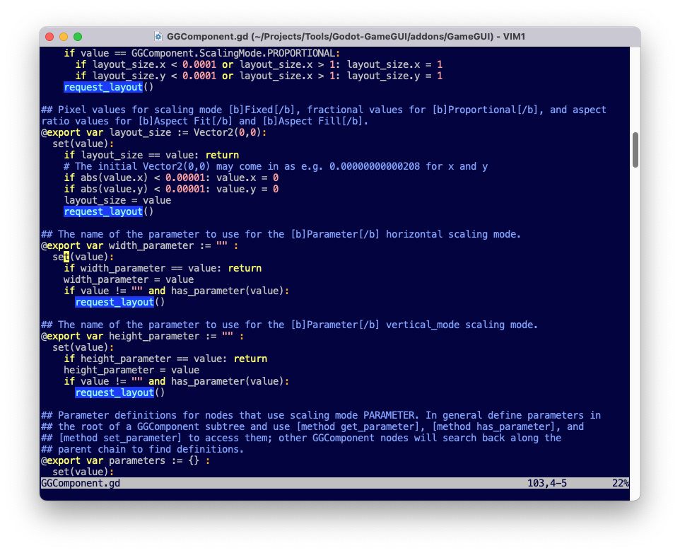

# SrcFix
A command-line tool for multi-line search and replace across text files.

About     | Current Release
----------|-----------------------
Version   | 1.0
Date      | August 26, 2023
Platforms | Windows, macOS, Linux
Author    | Brom Bresenham

# About
SrcFix allows multi-line search and replace across text files, facilitating
the management of boilerplate code and spot changes to specific
commands.

SrcFix ignores indentation while searching, but preserves
indentation when replacing or inserting.

# Example

We'll use SrcFix to modify a batch of GDScript files and replace this arbitrary line:

    request_layout()

With these two lines:

    pass
    #request_layout()

## Source Code Before Fix

## SrcFix Execution

## Source Code After Fix

## Reversing the Change

The fix commands to reverse the change would be:

    [search]
    pass
    #request_layout()

    [replace all]
    request_layout()

# Installation

## New Installation

1. Install [morlock.sh](https://morlock.sh)
2. `morlock install brombres/srcfix`

## Updating Existing Installation

    morlock update srcfix

# Usage

    USAGE
      srcfix [OPTIONS] [FILEPATHS]

    OPTIONS
      --file=<filepath>, -f <filepath>
        Read search-and-replace directives from the specified fix file instead of
        reading them interactively.

      --help, -h, -?
        Show this help text.

    DIRECTIVES
      The following search-and-replace directives are used by SrcFix. Each can be
      followed by any number of lines of arbitrary text. These directives will be
      applied in order to each file specified on the command line.

      SEARCH DIRECTIVES
        The search-and-replace window begins covering the entire file's content. The
        following directives refine the window. [after] and [before] can be used
        multiple times with cumulative effect. The search window is reset to cover
        full file content after each modification directive.

        [after]
          Move the start of the search-and-replace window to be just after the lines
          following the [after] directive.

        [before]
          Move the end of the search-and-replace window to be just before the lines
         following the [before] directive.

        [search]
          Narrows the search-and-replace window to enclose the first occurrence of
          the lines that follow the [search] directive.

      MODIFICATION DIRECTIVES
        [append]
          Appends the lines that follow the [append] directive to the end of the
          current search-and-replace window.

        [delete], [delete all]
          [delete] deletes all lines within the current search-and-replace window.
          [delete all] continues to repeat the previous [search] and delete the
          matching lines as long as the [search] continues to succeed.

        [insert]
          Inserts the lines that follow the [insert] directive at the beginning of
          the current search-and-replace window.

        [replace], [replace all]
          [replace] replaces the contents of the current search-and-replace window
          with the lines that follow the [replace] directive. [replace all]
          continues to repeat the previous [search] and replace the matching lines
          as long as the [search] continues to succeed.

    NOTES
      Indentation is ignored while searching but preserved when replacing or
      inserting.
